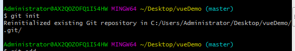
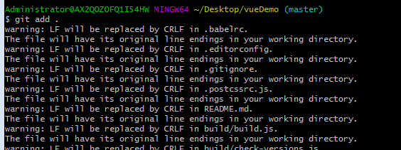
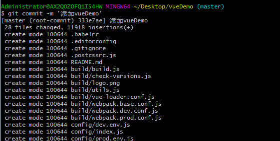
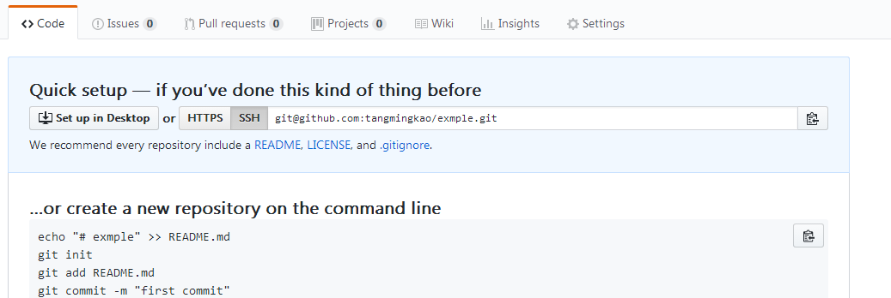
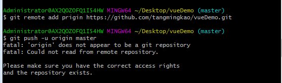
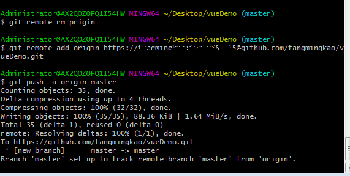
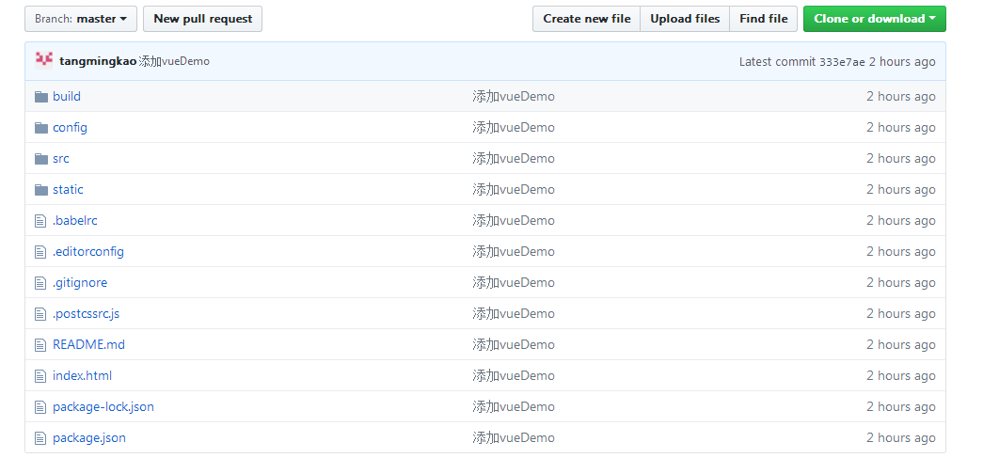

### 上传项目到github

有时候你在本地创建了一个vue项目后，然后你想把它上传到github上。有时候会有这样的问题，就是你在github上创建一个空的Repositories，但是你想通过soucetree和你的本地的项目关联起来时，就会用问题，如果你直接将本地项目文件作为你的github克隆地址时，就会说你本地路径文件非空。

所以当你在电脑上已经创建好了项目后，怎样将它上传到github呢？比如你已经在桌面生成了一个文件。


#### 创建本地仓库

1.首先打开Git Bash Here进入bash界面，然后cd到你的项目文件
```javascript
cd Desktop
cd vueDemo
```
或者直接在你的文件夹上鼠标右击，然后以Git Bash Here打开

2.然后运行
```javascript
git init
```


3.执行指令，将所有文件添加到仓库
```javascript
git add .
```
> 注意： add后面有一个 .



4.执行指令，提交文件
```javascript
git commit -m '提交说明'
```


5.关联到github仓库，首先创建一个空的仓库。不创建ignore和readme文件（下图只是实例图，不代表真实地址）



6.执行命令
```javascript
git remote add origin  xxxxxx
```
其中xxx是你创建的github地址。

7.然后执行命令，上传本地代码
```javascript
git push -u origin master
```

但是这里可能会出现以下的一个问题。



解决办法就是需要添加你的github用户名和密码

即你的地址会变成 https://用户名：密码@github.com/tangmingkao/vueDemo.git

这样就可以添加到github仓库了。





当然地址还可以是ssh类型的。如果是ssh类型的则需要添加ssh key。

[为github账号添加SSH keys](https://blog.csdn.net/qq_29232943/article/details/53523434)

