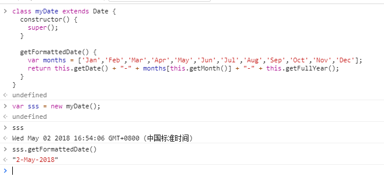
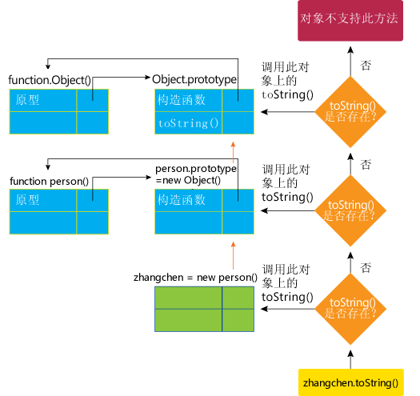
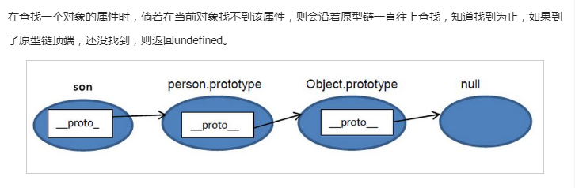

### 类

> 在javascript中，类的所以实例对象都从同一个原型对象上继续属性。因此原型对象是类的核.

##### 构造函数constructor

构造函数是用于创建和初始化类中创建的一个对象的一种特殊方法。

```javascript
constructor([arguments]){...};
```

在一个类中只能有一个名为constructor的特殊方法。一个类中出现多次构造函数方法会抛出一个SyntaxError错误。

在一个构造方法中可以使用super关键字来调用一个父类的构造方法。

如果没有显式制定构造方法，则会添加默认的construtor方法。

使用constructor方法

```javascript
class Square extends Polygon {
	constructor(length) {
		// 在这里, 它调用了父类的构造函数, 并将父类的 lengths 提供给 Polygon 的"width"和"height"
		super(length, length);
		// 注意: 在派生类中, 必须先调用 super() 才能使用 "this"。
		// 忽略这个，将会导致一个引用错误。
		this.name = 'Square';
	}
	get area() {
		return this.height * this.width;
	}
	set area(value) {
		this.area = value;
	}
}
```

对于基类，默认构造方法：
> constructor(){}

对于派生类，默认构造方法是：
> constructor(...args){
> 	 super(...args);
> }

##### extends关键字

extends关键字用于类声明或者类表达式中，以创建一个类，该类是另一个类的子类。

> class ChildClass extends ParentClass {...}

extends关键字用来创建一个普通类或者内建对象的子类。

继承的.prototype必须是一个Object 或者 null。

使用extends

```javascript
class Square extends Polygon {
	constructor(length) {
		// Here, it calls the parent class' constructor with lengths
		// provided for the Polygon's width and height
		super(length, length);
		// Note: In derived classes, super() must be called before you
		// can use 'this'. Leaving this out will cause a reference error.
		this.name = 'Square';
	}

	get area() {
		return this.height * this.width;
	}
}
```

使用extends继续内置对象

```javascript
class myDate extends Date {
	constructor() {
		super();
	}

	getFormattedDate() {
		var months = ['Jan','Feb','Mar','Apr','May','Jun','Jul','Aug','Sep','Oct','Nov','Dec'];
		return this.getDate() + "-" + months[this.getMonth()] + "-" + this.getFullYear();
	}
}
```

运行结果：



扩展null

```javascript
class nullExtends extends null {
	constructor() {}
}

Object.getPrototypeOf(nullExtends); // Function.prototype
Object.getPrototypeOf(nullExtends.prototype) // null
new nullExtends(); //ReferenceError: this is not defined
```

##### static静态方法

静态方法调用直接在类上进行，不能在类的实例上调用。静态方法通常用于创建实用程序函数。

在同一个类中的一个静态方法调用另一个静态方法，你可以使用 this 关键字。

```javascript
class StaticMethodCall {
	static staticMethod() {
		return 'Static method has been called';
	}
	static anotherStaticMethod() {
		return this.staticMethod() + ' from another static method';
	}
}
StaticMethodCall.staticMethod();
// 'Static method has been called'

StaticMethodCall.anotherStaticMethod();
// 'Static method has been called from another static method'

```

静态方法不能直接在非静态方法中使用 this 关键字来访问。你需要使用类名来调用它们：CLASSNAME.STATIC_METHOD_NAME() 或者将其作为构造函数的属性来调用该方法： this.constructor.STATIC_METHOD_NAME().

```javascript
class StaticMethodCall {
	constructor() {
		console.log(StaticMethodCall.staticMethod());
		// 'static method has been called.'
		console.log(this.constructor.staticMethod());
		// 'static method has been called.'
	}
	static staticMethod() {
		return 'static method has been called.';
	}
}

```

实例：

* 一个静态方法在一个类上是如何被实现的。
* 具有一个静态成员的一个类是可以被子类化 。
* 一个静态方法如何能被调用和不能被调用。

```javascript
class Tripple {
	static tripple(n) {
		n = n || 1;
		return n * 3;
	}
}

class BiggerTripple extends Tripple {
	static tripple(n) {
		return super.tripple(n) * super.tripple(n);
	}
}

console.log(Tripple.tripple()); 
// 3
console.log(Tripple.tripple(6));
// 18

let tp = new Tripple();

console.log(BiggerTripple.tripple(3));
// 81（不会受父类实例化的影响）

console.log(tp.tripple());
// 'tp.tripple 不是一个函数'.
```

### 原型

JavaScript 常被描述为一种基于原型的语言 (prototype-based language)——每个对象拥有一个原型对象，对象以其原型为模板、从原型继承方法和属性。原型对象也可能拥有原型，并从中继承方法和属性，一层一层、以此类推。这种关系常被称为原型链 (prototype chain)，它解释了为何一个对象会拥有定义在其他对象中的属性和方法。



准确地说，这些属性和方法定义在Object的构造器函数(constructor functions)之上的prototype属性上，而非对象实例本身。

在传统的OPP中，首先定义“类”，此后创建对象实例时，类中定义的所有属性和方法都被复制到实例中。在 JavaScript 中并不如此复制——而是在对象实例和它的构造器之间建立一个链接（它是__proto__属性，是从构造函数的prototype属性派生的），之后通过上溯原型链，在构造器中找到这些属性和方法。

> 注意: 理解对象的原型（可以通过Object.getPrototypeOf(obj)或者已被弃用的__proto__属性获得）与构造函数的prototype属性之间的区别是很重要的。前者是每个实例上都有的属性，后者是构造函数的属性。也就是说，Object.getPrototypeOf(new Foobar())和Foobar.prototype指向着同一个对象。

在javascript中，原型也是一个对象，原型的作用，则是实现对象的继续。在js的所有函数对象中，都存在一个属性prototype，该属性对应当前对象的原型。

javascript中__proto__是一个非标准的写法。是指向实例对象的构造函数的原型。获取或者设置实例对象的
构造函数的原型时，建议使用Object.getPrototypeOf()和Object.setPrototypeOf()访问器来访问。

```javascript
var p = new Person();
console.log(p.__proto__ === Person.prototype);  //true

```


> Object.getPrototypeOf()指向的是实例对象的构造函数的原型。


在查找一个对象的属性时，倘若在当前对象找不到该属性，则会沿着原型链一直往上查找，直到找到为止，如果到了原型链顶端，还没找到，则返回undefined.



几乎所有 JavaScript 中的对象都是位于原型链顶端的Object的实例。


对象的创建方式：
* 语法结构创建对象  //var obj = {a:1};
* 构造器创建  // function Gun (name){this.name = name;} var tim = new Gun(tim);
* Object.create()创建对象   //var obj = {a: 1}; var tempObj = Object.create(obj);
* class关键字创建   

```javascript
"use strict";

class Polygon {
  constructor(height, width) {
    this.height = height;
    this.width = width;
  }
}

class Square extends Polygon {
  constructor(sideLength) {
    super(sideLength, sideLength);
  }
  get area() {
    return this.height * this.width;
  }
  set sideLength(newLength) {
    this.height = newLength;
    this.width = newLength;
  }
}

var square = new Square(2);
```

遍历对象属性时，原型链上的每个可枚举属性都会被枚举出来。要检查对象是否具有自己定义的属性，而不是其原型链上的某个属性，则必须使用所有对象从Object.prototype继承的 hasOwnProperty 方法。

> hasOwnProperty 是 JavaScript 中唯一处理属性并且不会遍历原型链的方法。
> 注意：检查属性是否undefined还不够。该属性可能存在，但其值恰好设置为undefined。

实例的构造函数属性（constructor）指向构造函数。

